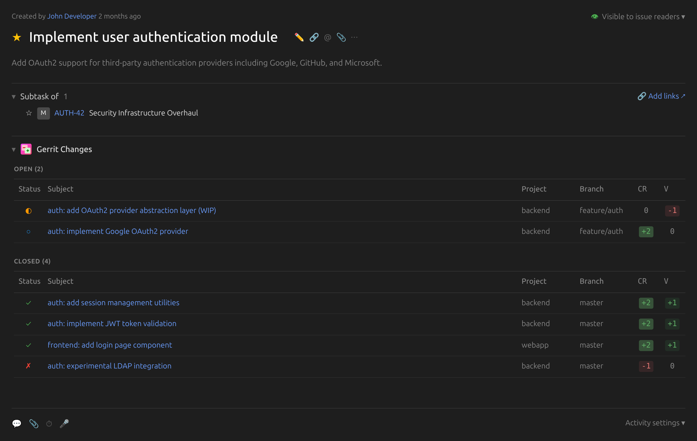

#  YouTrack Gerrit Plugin

A YouTrack App that integrates with Gerrit Code Review to display related Change Requests (CRs) directly within issue views.

[](https://plugins.jetbrains.com/plugin/29633-gerrit-integration)

## Features

- **Issue Integration**: Displays Gerrit changes related to the current issue in the issue view
- **Status Display**: Shows change status (NEW, MERGED, ABANDONED) with color-coded badges
- **Approval Labels**: Displays Code-Review, Verified, and other label scores
- **Rich Metadata**: Shows project, branch, author, line changes, and relative timestamps
- **Direct Links**: Click on any change to open it in Gerrit

## Screenshot



*The Gerrit Changes widget displays all related code reviews directly in the YouTrack issue view, organized by status (Open/Closed) with approval labels.*

## Getting Started

### Installation

#### Easy Installation (Recommended)

The easiest way to install this plugin is from the **[JetBrains Marketplace](https://plugins.jetbrains.com/plugin/29633-gerrit-integration)**:

1. Go to YouTrack: **Administration > Apps**
2. Click **Install app from JetBrains Marketplace**
3. Search for "Gerrit Integration" and install
4. Go to **Administration > Apps > Gerrit Integration** and configure the settings (see Configuration below)

#### Manual Installation

**Prerequisites:**
- YouTrack 2023.3 or later
- Gerrit 2.13 or later (REST API support required)
- Node.js 18+ (for building)

**Building:**

```bash
# Install dependencies
npm install

# Build the app
npm run build

# Create zip package for upload
npm run pack
```

**Installing in YouTrack:**

1. Build and pack the app (see above)
2. Go to YouTrack: **Administration > Apps**
3. Click **New app** and upload the generated `.zip` file from `dist/`
4. Go to **Administration > Apps > Gerrit Integration** and configure the settings (see Configuration below)

#### Development Upload

For development, you can upload directly:

```bash
# Set environment variables in .env file, then once:
source .env

# Build and upload
npm run build
npm run upload -- --host $YOUTRACK_BASE_URL --token $YOUTRACK_TOKEN
```

### Configuration

#### Step 1: Gather Required Information

Before configuring the plugin, you'll need to obtain your Gerrit credentials:

**Gerrit URL:** The base URL of your Gerrit server (e.g., `https://gerrit.example.com`)

**Gerrit Username:** Your Gerrit username (the same one you use to log into Gerrit web interface)

**Gerrit HTTP Password:** This is a special password for API access, NOT your regular login password. To generate it:

1. Log into Gerrit web interface (https://gerrit.example.com/)
2. Click your **profile icon** (top-right corner) or go to **Settings**
3. Select **HTTP Credentials** (or **HTTP Password**)
4. If no credentials exist, click **Generate New Password**
5. Click to reveal the password (it may be hidden initially)
6. Copy the **entire password** - you'll need it for YouTrack configuration
7. Keep this password secure; you won't see it again

#### Step 2: Configure in YouTrack

1. Go to YouTrack: **Administration > Apps > Gerrit Integration > Settings**
2. Fill in the required settings:

| Setting | Description | Required |
|---------|-------------|----------|
| **Gerrit URL** | Base URL of your Gerrit server (e.g., `https://gerrit.example.com`) | Yes |
| **Gerrit Username** | Your Gerrit username (from Step 1) | Yes |
| **Gerrit HTTP Password** | HTTP password from Gerrit Settings (from Step 1) - NOT your login password | Yes |
| **Search Query Pattern** | Query pattern to find changes. Use `%s` as issue ID placeholder. Default: `message:%s` | No |
| **Show Empty Widget** | Show widget even when no related changes are found | No |

3. Click **Save** to apply the configuration

#### Troubleshooting Configuration

- **"HTTP 401 Unauthorized"**: Double-check your username and HTTP password. Make sure you're using the HTTP password from Gerrit Settings, NOT your account login password.
- **"HTTP 403 Forbidden"**: Your Gerrit user account may not have permission to query changes. Contact your Gerrit administrator to check your access permissions.
- **Settings not saving**: Ensure all required fields are filled in and valid URLs are provided.

#### Optional Settings

**Search Query Pattern:** Customize how the plugin finds related changes in Gerrit. The plugin uses Gerrit's search query syntax. Use `%s` as a placeholder for the issue ID.

Common patterns:

| Pattern | Description |
|---------|-------------|
| `message:%s` | Search in commit message (default) |
| `tr:%s` | Search in tracking fields (Bug:, Issue: footers) |
| `topic:%s` | Search in change topic |
| `message:%s OR tr:%s` | Search in both message and tracking fields |

**Show Empty Widget:** Enable this to display the Gerrit widget on issue pages even when no related changes are found. By default, the widget is hidden if there are no matching changes.

## Usage

Once configured, the widget automatically appears on issue pages:

1. Open any issue in YouTrack
2. The "Gerrit Changes" widget appears above the activity stream
3. Related changes are displayed grouped by status (Open/Closed)
4. Click on any change subject to open it in Gerrit

## Development

### Project Structure

```
├── manifest.json           # App manifest
├── src/
│   ├── settings.json       # Settings schema
│   ├── gerrit-api.js       # Backend HTTP handler
│   └── widgets/
│       └── crlist/         # CR list widget
│           ├── app.tsx     # Main React component
│           ├── app.css     # Widget styles
│           ├── index.tsx   # React entry point
│           └── index.html  # Widget HTML
├── doc/
│   ├── ARCHITECTURE.md     # Technical architecture
│   └── COPILOT-INSTRUCTIONS.md  # AI assistant guide
└── @types/
    └── globals.d.ts        # TypeScript definitions
```

### Build Commands

```bash
npm install       # Install dependencies
npm run build     # Build for production
npm run pack      # Create zip package
npm run upload    # Build and upload to YouTrack
npm run lint      # Run ESLint
```

### Technology Stack

- **Frontend**: React 18, TypeScript, Vite
- **UI Components**: JetBrains Ring UI
- **Backend**: JavaScript (YouTrack scripting runtime)
- **External API**: Gerrit REST API

## Troubleshooting

### "Gerrit connection not configured"

Configure the plugin settings in YouTrack Administration.

### "Failed to query Gerrit: HTTP 401"

Check your Gerrit username and HTTP password. Make sure you're using the HTTP password from Gerrit settings, not your account password.

### "Failed to query Gerrit: HTTP 403"

Your Gerrit user may not have permission to query changes. Check Gerrit access permissions.

### No changes found

1. Verify the issue ID appears in commit messages or tracking fields
2. Check the search query pattern matches your workflow
3. Try testing the query directly in Gerrit's web search

### CORS errors

The widget proxies all requests through the YouTrack backend. If you see CORS errors in the browser console, there may be a configuration issue.

## Contributing

Contributions are welcome! Please feel free to submit a Pull Request.

## License

BSD 3-Clause License - see [LICENSE](LICENSE) for details

## Credits

Inspired by the [JIRA Gerrit Plugin](https://github.com/MeetMe/jira-gerrit-plugin) by MeetMe.

## Author

Phoenix Systems (https://phoenix-rtos.com/)
